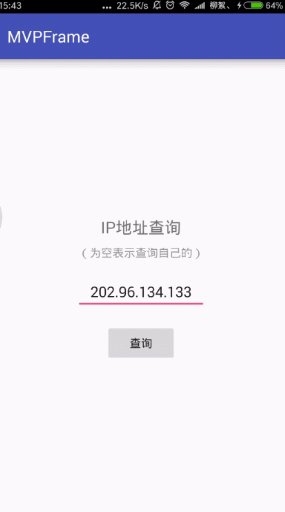

# MVPFrame
[](https://raw.githubusercontent.com/jenly1314/MVPFrame/master/app/app-release.apk)
[](https://jitpack.io/#jenly1314/MVPFrame)
[](https://opensource.org/licenses/mit-license.php)
[](http://blog.csdn.net/jenly121)

MVPFrame for Android 是一个集合了 Retrofit2 + RXJava2 + OkHttp3 + Mosby3 二次封装的MVP架构基类库，方便敏捷开发，后续会持续更新并完善。

## Gif 展示


## 引入

### Maven：
```maven
<dependency>
  <groupId>com.king.frame</groupId>
  <artifactId>mvpframe</artifactId>
  <version>1.0.5</version>
  <type>pom</type>
</dependency>
```
### Gradle:
```gradle
compile 'com.king.frame:mvpframe:1.0.5'
```
### Lvy:
```lvy
<dependency org='com.king.frame' name='mvpframe' rev='1.0.5'>
  <artifact name='$AID' ext='pom'></artifact>
</dependency>
```

###### 如果Gradle出现compile失败的情况，可以在Project的build.gradle里面添加如下：（也可以使用上面的GitPack来complie）
```gradle
allprojects {
    repositories {
        maven { url 'https://dl.bintray.com/jenly/maven' }
    }
}
```

## 引入的库：
```gradle
    // Model-View-Intent
    compile 'com.hannesdorfmann.mosby3:mvi:3.0.4'
    // Plain MVP
    compile 'com.hannesdorfmann.mosby3:mvp:3.0.4'
    // MVP + ViewState support
    compile 'com.hannesdorfmann.mosby3:viewstate:3.0.4'

    compile 'com.squareup.retrofit2:retrofit:2.3.0'
    compile 'com.squareup.retrofit2:converter-gson:2.3.0'
    compile 'com.squareup.retrofit2:adapter-rxjava2:2.3.0'

    compile 'com.squareup.okhttp3:okhttp:3.9.1'
    compile 'com.squareup.okhttp3:logging-interceptor:3.9.1'

    compile 'io.reactivex.rxjava2:rxjava:2.1.1'
    compile 'io.reactivex.rxjava2:rxandroid:2.0.1'

    compile 'com.orhanobut:logger:1.15'
```

## 示例

核心代码（在你项目的Application中的onCreate方法里面初始化）
```Java
//初始化：第一个参数是基本的Url地址，第二个参数是超时时间（单位为秒，可不填，默认为20s）
ApiManager.init(String baseUrl,int timeout);
```

代码示例 （示例出自于[app](app)中的Api.java）
```Java
public class Api {

    private Api(){
        throw new AssertionError();
    }

    private static ApiService getApiService(){
        if(apiService == null){
            apiService = ApiManager.getInstance().getApiService(ApiService.class);
        }
        return apiService;
    }

    public static void getApiAddr(String ip, SimpleCallback<IPAddress> callback){
        ApiObserver.subscribe(getApiService().getIPAddr(ip),callback);
    }
}
```
更多使用详情，请查看[app](app)中的源码使用示例

## 关于我
   Name: <a title="关于作者" href="https://about.me/jenly1314" target="_blank">Jenly</a>

   Email: <a title="欢迎邮件与我交流" href="mailto:jenly1314@gmail.com" target="_blank">jenly1314#gmail.com</a> / <a title="给我发邮件" href="mailto:jenly1314@vip.qq.com" target="_blank">jenly1314#vip.qq.com</a>

   CSDN: <a title="CSDN博客" href="http://blog.csdn.net/jenly121" target="_blank">jenly121</a>

   Github: <a title="Github开源项目" href="https://github.com/jenly1314" target="_blank">jenly1314</a>

   微信公众号:

   
   
   加入QQ群: <a title="点击加入QQ群" href="http://shang.qq.com/wpa/qunwpa?idkey=8fcc6a2f88552ea44b1411582c94fd124f7bb3ec227e2a400dbbfaad3dc2f5ad" target="_blank">20867961</a>
   
   
   
