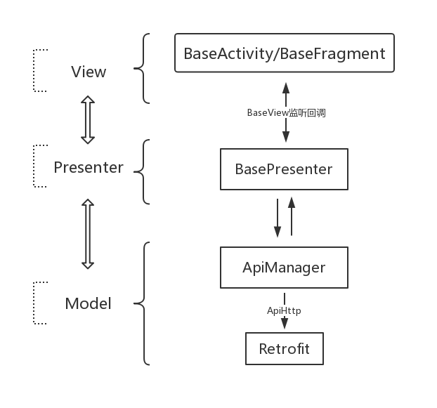

# MVPFrame


[](https://jitpack.io/#jenly1314/MVPFrame)
[](https://raw.githubusercontent.com/jenly1314/MVPFrame/master/app/release/app-release.apk)
[](https://developer.android.com/guide/topics/manifest/uses-sdk-element#ApiLevels)
[](https://opensource.org/licenses/mit)


MVPFrame for Android 是一个集合了 Retrofit2 + RXJava2 + OkHttp3 + Mosby3 二次封装的MVP快速开发框架，为敏捷开发而生。

> 你可以直接下载 [演示App](https://raw.githubusercontent.com/jenly1314/MVPFrame/master/app/release/app-release.apk) 体验效果

## 架构


## 引入

### Gradle:

1. 在Project的 **build.gradle** 或 **setting.gradle** 中添加远程仓库

    ```gradle
    repositories {
        //...
        mavenCentral()
        maven { url 'https://jitpack.io' }
    }
    ```

2. 在Module的 **build.gradle** 中添加依赖项

    ```gradle
    implementation 'com.github.jenly1314:MVPFrame:1.1.3'
    ```

## 使用

### 集成步骤

集成步骤代码示例 （示例出自于[app](app)中）

Step.1 启用DataBinding，在你项目中的build.gradle的android{}中添加配置：
```gradle
dataBinding {
    enabled true
}
```

Step.2 通过ApiManager初始化（在你项目的Application中的onCreate方法里面初始化）
```Java
//初始化：第一个参数是基本的Url地址，第二个参数是超时时间（单位为秒，可不填，默认为15s）
ApiManager.init(String baseUrl,int timeout);
```

Step.3 定义一个类似于[app](app)中的Api来管理接口
```Java
    public class Api {

        private ApiService mApiService;

        private static Api sInstance;

        public static Api getInstance(){
            if(sInstance == null){
                synchronized (Api.class){
                    if(sInstance == null){
                        sInstance = new Api();
                    }
                }
            }
            return sInstance;
        }

        private Api(){
            mApiService = ApiManager.getInstance().getApiService(ApiService.class);
        }

        /**
         * 获取推荐诗词
         * @param callback
         */
        public void getRecommendPoetry(SimpleCallback<Result<PoetryInfo>> callback){
            ApiObserver.subscribe(mApiService.getRecommendPoetry(),callback);
        }

    }

```
更多使用详情，请查看[app](app)中的源码使用示例或直接查看[API帮助文档](https://jitpack.io/com/github/jenly1314/MVPFrame/latest/javadoc/)

## 相关推荐
- [MVVMFrame](https://github.com/jenly1314/MVVMFrame) 一个基于Google官方推出的JetPack构建的MVVM快速开发框架。
- [AppTemplate](https://github.com/jenly1314/AppTemplate) 一款基于 MVVMFrame 构建的App模板。
- [AppUpdater](http://github.com/jenly1314/AppUpdater) 一个专注于App更新，一键傻瓜式集成App版本升级的轻量开源库。
- [RetrofitHelper](http://github.com/jenly1314/RetrofitHelper) 一个支持动态改变BaseUrl，动态配置超时时长的Retrofit帮助类。
- [BaseUrlManager](http://github.com/jenly1314/BaseUrlManager) 一个BaseUrl管理器，主要用于打测试包时，一个App可动态切换到不同的开发环境或测试环境。
- [SuperTextView](http://github.com/jenly1314/SuperTextView) 一个在TextView的基础上扩展了几种动画效果的控件。
- [ImageViewer](http://github.com/AndroidKTX/ImageViewer) 一个图片查看器，一般用来查看图片详情或查看大图时使用。
- [GuidePage](http://github.com/AndroidKTX/GuidePage) 一个App欢迎引导页。一般用于首次打开App时场景，通过引导页指南，概述App特色等相关信息。
- [LogX](http://github.com/jenly1314/LogX) 一个轻量而强大的日志框架；好用不解释。
- [KVCache](http://github.com/jenly1314/KVCache) 一个便于统一管理的键值缓存库；支持无缝切换缓存实现。
- [AndroidKTX](http://github.com/AndroidKTX/AndroidKTX) 一个简化 Android 开发的 Kotlin 工具类集合。
- [AndroidUtil](http://github.com/AndroidUtil/AndroidUtil) 一个整理了Android常用工具类集合，平时在开发的过程中可能会经常用到。


## 版本日志

#### v1.1.3：2019-6-21
*  优化部分细节
*  Retrofit更新至v2.6.0
*  RxJava更新至v2.2.9

#### v1.1.2：2019-5-27
*  完善BindingFragment相关子类

#### v1.1.1：2019-4-29
*  新增DataBinding支持
*  Retrofit更新至v2.6.0
*  RxJava更新至v2.2.8
*  RxAndroid更新至v2.1.1

#### v1.1.0：2018-7-23
*  Retrofit更新至v2.4.0
*  RxJava更新至v2.1.16
*  RxAndroid更新至v2.0.2

#### v1.0.6：2018-5-17
*  暴露Dialog更多参数，让配置更加灵活

#### v1.0.5：2018-1-29
*  新增默认信任SSL证书，支持https

#### v1.0.4：2018-1-18
*  优化BaseProgressDialog

#### v1.0.3：2017-12-4
*  新增请求相应Log日志信息方便调试。

#### v1.0.2：2017-9-21
*  新增QuickActivity、QuickFragment。

#### v1.0.1：2017-8-18
*  将retrofit中的adapter修改为adapter-rxjava2 v1.0

#### v1.0.0：2017-7-5
*  MVPFrame初始版本

---


